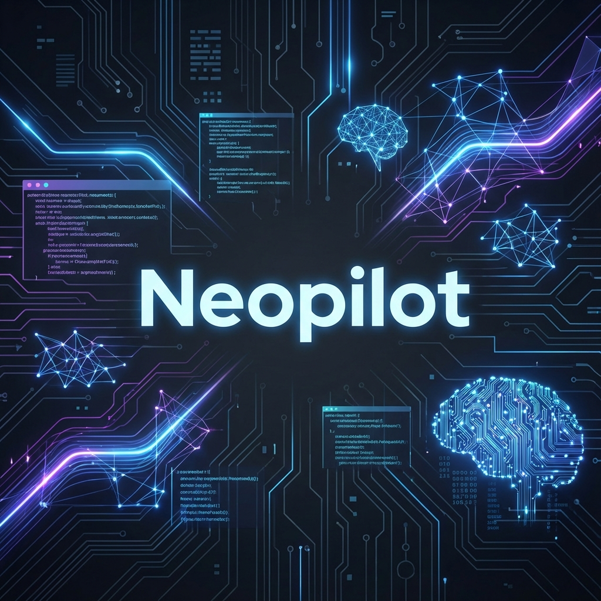

<p align="center">
  
</p>

# 🚀 Neopilot for Visual Studio

**The modern AI coding superpower for Visual Studio.**

Neopilot brings state-of-the-art large language models directly into your IDE, helping you write, understand, refactor, and debug code faster—without breaking your flow. Designed for professionals, built for speed, and completely free.

---

<p align="center">
  <a href="https://twitter.com/intent/follow?screen_name=khulnasoft">
    
  </a>
  
  <a href="https://neopilot-ai.github.io">
    
  </a>
</p>

<p align="center">
  <b>Available on</b><br>
  <a href="https://marketplace.visualstudio.com/items?itemName=Neopilot.NeopilotVS">Visual Studio</a> • 
  <a href="https://marketplace.visualstudio.com/items?itemName=Neopilot.neopilot">VS Code</a> • 
  <a href="https://plugins.jetbrains.com/plugin/20540-neopilot/">JetBrains</a> • 
  <a href="https://open-vsx.org/extension/Neopilot/neopilot">Open VSX</a> • 
  <a href="https://chrome.google.com/webstore/detail/neopilot/hobjkcpmjhlegmobgonaagepfckjkceh">Chrome</a>
</p>

---

## ✨ Why Neopilot?

Neopilot eliminates the repetitive and frustrating parts of coding so you can focus on **architecture, logic, and creativity**. Whether you're starting fresh or maintaining a large legacy codebase, Neopilot works *with* your code—not against it.

### Key Benefits

* ⚡ **Blazing-Fast AI Completions**
  Context-aware, multi-line suggestions as you type.

* 💬 **Deeply Integrated AI Chat**
  Ask questions, generate code, or debug issues without leaving Visual Studio.

* 🧠 **70+ Programming Languages**
  C#, Java, Python, Rust, Go, JavaScript, TypeScript, and more.

* 🛠️ **Smart Refactoring & Explanation**
  Rewrite, optimize, or explain complex logic in seconds.

* 🆓 **100% Free, No Limits**
  Unlimited completions and chat—no subscriptions, no paywalls.

---

## 🏎️ Autocomplete Superpowers

### 📝 Natural Language → Code

Describe what you want in plain English and Neopilot generates clean, idiomatic code that matches your project style.

<p align="center">
  
</p>

### 🛠️ Eliminate Boilerplate

Neopilot predicts patterns and handles repetitive code so you stay focused and productive.

<p align="center">
  
</p>

---

## 💬 Chat & Code Analysis

Neopilot’s AI chat is **IDE-native**, context-aware, and designed for real development workflows.

| Capability    | What It Does                                       | Preview                                                        |
| ------------- | -------------------------------------------------- | -------------------------------------------------------------- |
| **Generate**  | Create full functions, classes, or components      |  |
| **Explain**   | Understand unfamiliar code or APIs instantly       |            |
| **Refactor**  | Improve structure, performance, or readability     |           |
| **Translate** | Convert logic between languages (e.g. Python → C#) |            |
| **Debug**     | Explain compiler errors and runtime issues         |    |

---

## 🚀 Quick Start

1. Install **Neopilot for Visual Studio** from the marketplace
2. Open any solution or file
3. Start typing or open the Neopilot Chat
4. Let AI accelerate your workflow ✨

> No account required. No configuration needed.

---

## 🛠️ Build from Source

Interested in contributing or building locally?

### Prerequisites

* **Visual Studio 2022**

  * *Visual Studio extension development* workload
* **Extensibility Essentials 2022**

### Build Steps

```text
1. Open NeopilotVS.sln
2. Build the solution (Ctrl + Shift + B)
3. Locate the .vsix in:
   NeopilotVS/bin/Debug or Release
4. Press F5 to launch an Experimental Visual Studio instance
```

---

## 🧩 Roadmap (High-Level)

* 🔍 Deeper semantic code understanding
* 🧪 Smarter test generation
* 🧠 Project-wide reasoning
* 🔐 Enterprise & offline modes
* 🧩 Plugin & agent ecosystem

---

## ❤️ Community & Support

We welcome feedback, ideas, and contributions.

* 🐞 **Bug Reports & Feature Requests**
  [Open an issue on GitHub](https://github.com/Neopilot-ai/NeopilotVisualStudio/issues)

* 🌍 **Follow Updates**
  Twitter: [@khulnasoft](https://twitter.com/khulnasoft)

---

## 📄 License

Licensed under the **MIT License**.
See [LICENSE.txt](LICENSE.txt) for full details.

---

<p align="center">
  Built with ❤️ by the Neopilot team and open-source contributors.
</p>